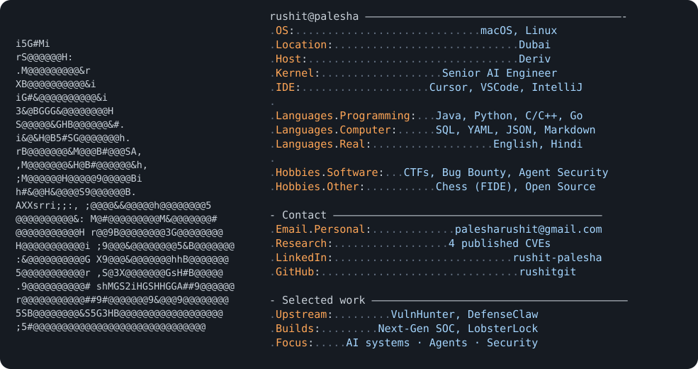

<p align="center">
  <picture>
    <source media="(prefers-color-scheme: dark)" srcset="dark_mode.svg" />
    <source media="(prefers-color-scheme: light)" srcset="light_mode.svg" />
    
  </picture>
</p>

# Rushit Palesha

```text
> NAME        security-tilted builder · chess on the clock · flag chaser
> LOC         Dubai
> ROLE        Senior AI Engineer · Security @ Deriv
> DEGREE      CS — BITS Pilani, Dubai Campus (’21–’25)
> SIDE QUESTS CVEs · HackerOne · agent / MCP hardening · CTFs
```

If you’re human: I like **systems that misbehave in interesting ways**, **agent boundaries**, and **competitions where the clock is honest**.

Longer form (selected work, research writeups, receipts): **[rushit-portfolio-theta.vercel.app](https://rushit-portfolio-theta.vercel.app/)**

---

## Where to click

| Go | You’ll find |
| :--- | :--- |
| [Published CVEs](#published-cves) | Electron · OpenImageIO — coordinated disclosure |
| [Scoreboard exports](#scoreboard-exports) | CTF numbers, vendor finals, no slideshow |
| [What I actually do](#what-i-actually-do) | Work, OSS, bounty — one breath each |
| [Upstream merges](#upstream-merges) | VulnHunter · DefenseClaw |
| [Stack + shields](#stack-and-badges) | Boring but honest |
| [Say hi](#say-hi) | Mail · LinkedIn · portfolio |

---

## Published CVEs

| ID | Target | Signal |
| :--- | :--- | :--- |
| [**CVE-2026-70606**](https://www.cve.org/CVERecord?id=CVE-2026-70606) | [Electron](https://github.com/electron/electron/security/advisories/GHSA-r4w5-6pfg-jxp5) | Session-isolation / cache reuse via `ProtocolResponse.url` · Medium · CVSS 5.9 · CWE-668 |
| [**CVE-2026-59956**](https://github.com/AcademySoftwareFoundation/OpenImageIO/security/advisories/GHSA-hjfv-gvxc-qgvh) | OpenImageIO | Heap-buffer-overread in IFF decoder when Z-buffer is set · CWE-125 |

---

## Scoreboard exports

<details open>
<summary><code>[+] cat ./ctf/ledger.tsv</code> — merged results</summary>

| When | What | Signal |
| :--- | :--- | :--- |
| 2026 | [HTB](https://www.hackthebox.com/) Project Nightfall · Global Cyber Skills Benchmark | **Global 23rd** · **UAE 3rd** · 122 / 126 chals · 75,200 pts |
| 2026 | HTB Cyber Apocalypse | **294 / 6,744** teams · 83 / 136 chals · 3-person team |
| 2026-02 | [Snyk](https://snyk.io/ctf/) Fetch the Flag | **56 / 1539** · **2100** pts · **6 / 22** chals |
| 2025-10 | GITEX — UAE CSC CTF ([CTF.ae](https://gitex.ctf.ae/) world) | **3rd** · finals · tracks: web, pwn, DFIR, RE, coding, AI/ML-adjacent |
| 2025-08 | Kaspersky CTF · 24h (UAE CSC adjacency) | **12 / 415** (MEA, TR, Africa) · **2nd UAE** · **660** pts · web · RE · crypto · forensics · pwn · AI |
| — | Dubai Police CTF · academic track | **1st UAE** |
| — | Internal **AI / agent** build-off | **2nd** · **$5k** · NL → agents + tools · OpenAI Agents SDK |

</details>

<details open>
<summary><code>[+] ls ./ctf/archive/</code> — older loot</summary>

- NASA Space Apps **2023** — UAE winner · global nominee  
- IEEE Xtreme **17.0** — UAE section lead  
- GDG on Campus BITS Dubai — tech lead  
- Chess — **FIDE** rated · NYU inter-college **3rd** · [Lichess @rush21](https://lichess.org/@/rush21)  
- Paper — [*ChatGPT and the Social Media Echo: A Sentiment Analysis*](https://ieeexplore.ieee.org/document/10458761) (MoSICom 2023)  
- Past gigs — JetSynthesys · Cybage · Force Motors  

</details>

---

## What I actually do

| Bucket | Contents |
| :--- | :--- |
| **9–5-shaped** | Senior AI Engineer in Security @ Deriv — agent-security controls, supply-chain defenses, SOC / AI-assisted testing, DLP, anomaly detection. |
| **Vuln research** | Coordinated disclosure into upstream (Electron, OpenImageIO). Niche over noise. |
| **Public goods** | **LobsterLock** — host-level policy layer for autonomous agents (OpenClaw runtime boundary: cmd / net / fs). **[DefenseClaw](https://github.com/cisco-ai-defense/defenseclaw)** — scan and govern agent surfaces: skills, MCP, tool calls. |
| **Solo queue** | **[HackerOne](https://www.hackerone.com/)** — real bounties, real scopes, real consequences. |

---

## Upstream merges

| Repo | What landed |
| :--- | :--- |
| [Capital One / VulnHunter#21](https://github.com/capitalone/VulnHunter/pull/21) | Fixed repository-basename collisions in batch scans — preserve owner/repo identity across checkout, logs, results, resume state. |
| [Cisco AI Defense / DefenseClaw](https://github.com/cisco-ai-defense/defenseclaw) | Structured network-egress telemetry: query filters, blocked-call counts, OTel counters, optional Splunk forwarding ([#58](https://github.com/cisco-ai-defense/defenseclaw/pull/58), [#86](https://github.com/cisco-ai-defense/defenseclaw/pull/86)). |

---

## Stack and badges

**Languages:** Python · Java · C / C++ · Go · TypeScript · SQL  
**AI / agents:** RAG · evaluation · OpenAI / Anthropic · LangChain · agent guardrails  
**Security:** SOC · DLP · LLM/agent abuse cases · vuln research · automation without theater  
**Backend & data:** FastAPI · Flask · Spring · Postgres · MySQL · SQL Server · Neo4j · vector stores · Kafka · RabbitMQ · Pub/Sub  
**Platform:** Docker · Linux · Git  

<p align="left">
  <a href="https://rushit-portfolio-theta.vercel.app/"></a>
  <a href="https://www.linkedin.com/in/rushit-palesha/"></a>
  <a href="mailto:palesharushit@gmail.com"></a>
  <a href="https://github.com/electron/electron/security/advisories/GHSA-r4w5-6pfg-jxp5"></a>
  <a href="https://github.com/cisco-ai-defense/defenseclaw"></a>
  <a href="https://www.hackerone.com/"></a>
</p>

<details>
<summary><code>[+] make shields-expand</code> — full gadget rack</summary>

[](https://www.oracle.com/java/)
[](https://www.python.org)
[](https://go.dev/)
[](https://www.typescriptlang.org/)
[](https://isocpp.org/)
[](https://en.wikipedia.org/wiki/C_(programming_language))
[](https://spring.io/)
[](https://spring.io/projects/spring-batch)
[](https://flask.palletsprojects.com/)
[](https://fastapi.tiangolo.com/)
[](https://maven.apache.org/)
[](https://gradle.org/)
[](https://www.postgresql.org/)
[](https://firebase.google.com/)
[](https://www.mysql.com/)
[](https://www.microsoft.com/sql-server)
[](https://openai.com/)
[](https://www.docker.com/)
[](https://git-scm.com/)
[](https://www.linux.org/)
[](https://www.rabbitmq.com/)
[](https://cloud.google.com/pubsub)
[](https://kafka.apache.org/)

</details>

---

## Say hi

**palesharushit@gmail.com** · **f20210010@dubai.bits-pilani.ac.in** · [LinkedIn](https://www.linkedin.com/in/rushit-palesha/) · [Portfolio](https://rushit-portfolio-theta.vercel.app/)

Good DMs: odd agentic trust bugs, **CVE** / disclosure edge cases, **CTF** war stories, **bounty** weirdness, **chess** panic moments.

---

<sub>This README’s threat model: markdown injection (you), recruiter copy-paste (them), and my future self forgetting to update the TSV.</sub>
